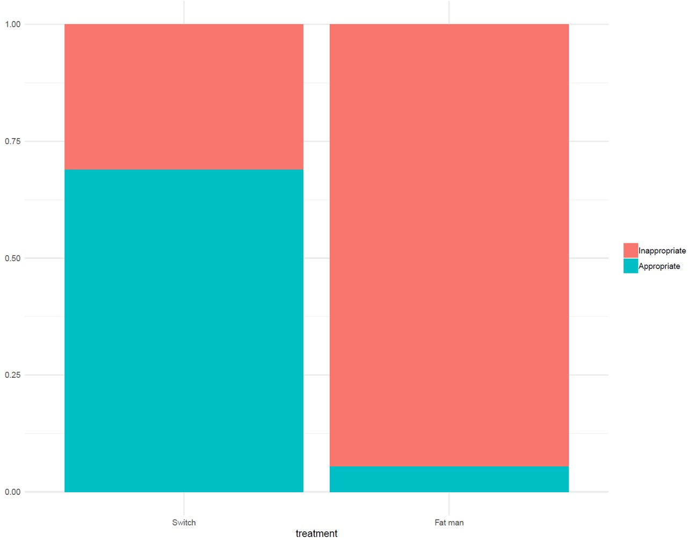
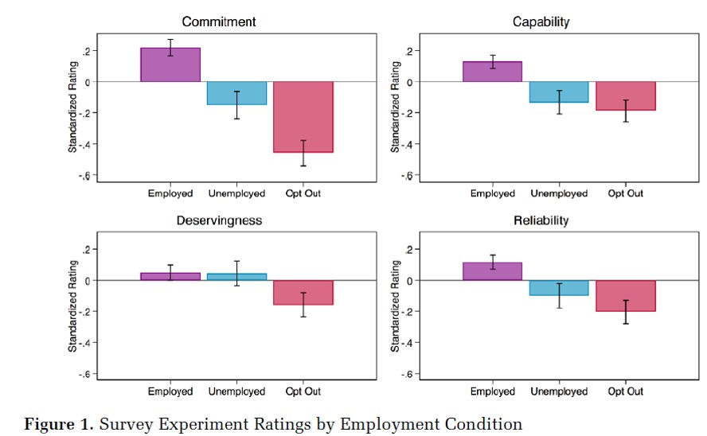
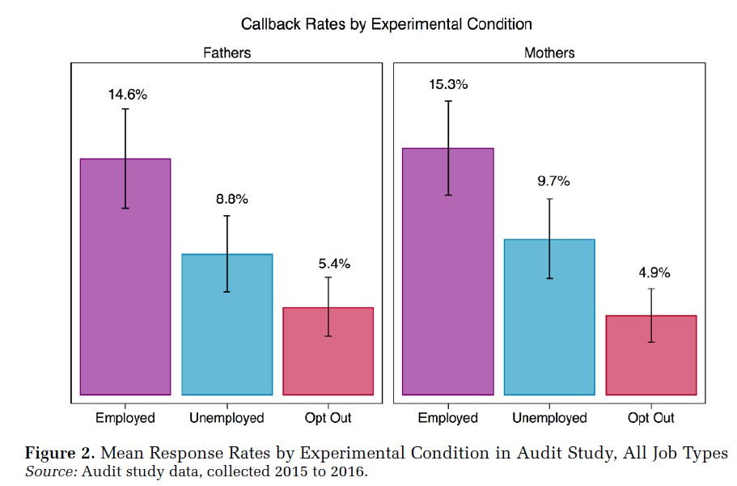

<style>
.center {
 text-align: center
}
</style>

```{r setup, echo=FALSE, message=FALSE}
knitr::opts_chunk$set(echo = FALSE, fig.align = 'center', message = FALSE)
library(tidyverse)

```


## Goals of the course

By the end of the course, you should know how to:

1. Import and manage data in R
2. Perform basic descriptive analysis
3. Create simple univariate and bivariate visualizations
4. Estimate and interpret basic regression models
5. Quantify the uncertainty of your conclusions
6. Make informed judgments about (simple) competing models
7. Create reproducible reports using R Markdown

## About R

- base R vs. tidyverse
- for tidyverse code, see link in Sakai
- you will learn tidyverse via DataCamp (custom track)
- for visualization basics, see <http://socviz.co>


## Things to be aware of

- R and RStudio
- R Markdown
- Slack
- DataCamp

## A typical week

**Monday**: skim/read chapter; start DataCamp

**Tuesday**: lecture (possible quiz)

**Wednesday**: reread chapter; go through chapter code

**Thursday**: ask questions in lab, practice coding

**Friday-Sunday**: complete exercises, submit via Sakai

## Questions?

# Causality and potential outcomes

## Asking causal questions

- Does more education *cause* higher wages?
- Does participating in a job training program *cause* a higher probability of employment?
- Do boycotts *cause* a drop in a company's share price?
- These are tough questions!

## Threats to causal inference
```{r, out.width="50%"}
knitr::include_graphics("confounding.JPG")

```

## Key term: Identification
How do we *identify* the effect of a treatment (cause) on an outcome?

## Experiments and the "independent variable"

- What is an experiment?
- How do experiments solve the problem we just talked about?

## Example: Audit study

- Correll et al. sent fake resumes and cover letters to 300+ employers
- Treatment categories
  - Mother (PTA officer; relocating "with family")
  - Childless (alumni officer; relocating)

## Results

```{r, out.width="80%"}
knitr::include_graphics("correll.png")

```

<p class="center">They find a negative effect of motherhood on the probability of a call back</p>

## Results
```{r}
d <- tibble( treatment = c( "mother", "childless" ) ,
             call_pct = c(.031, .066) )
ggplot( d , aes( x = treatment, y = call_pct )) +
  geom_bar(stat = "identity") +
  labs(y = "Proportion Called Back") +
  theme_minimal()

```

## Experiments are great!

Assuming successful randomization to treatment and control, 
you **know** it's the treatment that's causing the effect.

## Experiments can't do everything

- ethics
- external validity
- often non-representative
- some treatments are hard or impossible to assign randomly
  - motherhood
  - divorce
  - boycotts
  
## Why are experiments able to identify causal effects?

## Some notation

$T$  a binary treatment variable

$Y$  the value of the outcome we observe

$Y^0$  the value the outcome *would* take if $T=1$

$Y^1$  the value the outcome *would* take if $T=0$

Let's think about the last two a bit more carefully...


## The world before the experiment

Subject      $Y^0$   $Y^1$   $T$   $Y$
----------- ------- ------- ----- -----
Andrew        2        3      
Barb          3        4      
Catherine     3        4      
David         2        3      


<div class = center>

What do these numbers mean?

</div>

## The world after the experiment

Subject      $Y^0$   $Y^1$   $T$   $Y$
----------- ------- ------- ----- -----
Andrew                 3      1     3
Barb          3               0     3
Catherine              4      1     4
David         2               0     2

$$ Y = TY^1+(1-T)Y^0 $$

##

<div class = center>

$Y = Y^1$ for $T = 1$

$Y = Y^0$ for $T = 0$

We **can't know** $Y^1$ for those who are $T=0$

We **can't know** $Y^0$ for those who are $T=1$

### This is the **fundamental problem of causal inference.**

</div>


## Potential outcomes and counterfactuals

<div class = center>
$Y^0$ and $Y^1$ are *potential outcomes*

In the real world, $T$ is either 1 or 0 for each case.

We see $Y^1$ or $Y^0$, but never both.

When $T=0$, $Y^1$ is *counterfactual*

When $T=1$, $Y^0$ is *counterfactual*

</div>

## What do we want to know?

We really care about the difference between $Y^0$ and $Y^1$. (Why?)

Let $\delta_i = y^1_i - y^0_1$

$E[\delta]=E[Y^1-Y^0]$

$E[\delta]=E[Y^1]-E[Y^0]$

### This is the definition of a **treatment effect**


## Assume an experiment: What is $E[\delta]$?

Subject      $Y^0$   $Y^1$   $T$   $Y$
----------- ------- ------- ----- -----
Andrew        2        3      
Barb          3        4      
Catherine     3        4      
David         2        3      

### Why can't we make these calculations in real life?


## Assume an experiment: What is $E[\delta]$?

Subject      $Y^0$   $Y^1$   $T$   $Y$
----------- ------- ------- ----- -----
Andrew                 3      1     3
Barb          3               0     3
Catherine              4      1     4
David         2               0     2


### Does this give us the right answer? Why?


## Why can we do this with experiments?
$T \bot Y^0$

$T \bot Y^1$

$E[Y^0 | T = 0] = E[Y^0 | T = 1 ]$

$E[Y^1 | T = 0] = E[Y^1 | T = 1 ]$


## Or in other words...

In a properly executed experiment, there is no association between the potential 
outcome variables and treatment assignment.

$E[Y^0 | T = 0] \approx E[Y^0]$

$E[Y^1 | T = 1] \approx E[Y^1]$

So...

$E[\delta] = E[Y|T=1]-E[Y|T=0]$

The difference between the treatment average and the control average


## What is this treatment effect?

$E[\delta]$ is the expected value (mean) of the difference between each unit’s 
value of $Y^1$ and $Y^0$. It is the **average treatment effect (ATE).** 
In a sample, this is the **sample average treatment effect (SATE).**

Even though the individual differences are unobservable (because either $Y^0$ 
or $Y^1$ will be counterfactual for each unit), we can estimate the mean 
difference via experiment.

$$ \text{SATE} = \frac{1}{n}\sum_{i=1}^{n}(y^1_i - y^0_i) $$
 
## Randomization

- Experiments identify the SATE because cases are randomly assigned to the 
treatment and control group and are, therefore, identical **on average**, on 
all pre-treatment characteristics.

- Experiments are sometimes called **randomized controlled trials** (or RCTs)


## Internal and external validity

- **Internal validity**: the extent to which causal assumptions are satisfied
in the study

- **External validity**: the extent to which the conclusions can be generalized
beyond a particular study.


## Example: trolley problem
```{r}

```

##
```{r}


```

##
```{r, out.width="80%"}


```

<div class = center>

<small> Weisshaar, K. (2018). "From Opt Out to Blocked Out: The Challenges for Labor 
Market Re-entry after Family-Related Employment Lapses."
*American Sociological Review*, 83(1), 34–60. </small>

</div>


##
```{r, out.width="80%"}


```


