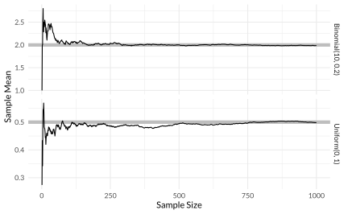

```{r setup, echo=FALSE, message = FALSE}
knitr::opts_chunk$set(
  echo = FALSE,
  fig.align = "center",
  fig.asp = 0.618,
  fig.retina = 3,
  fig.width = 6,
  message = FALSE,
  warning = FALSE,
  dev = "svg",
  out.width = "80%"
)
options(knitr.table.format = "html")
options(knitr.kable.NA = '   ')

library(here)
library(knitr)
library(tidyverse)
library(broom)
library(DiagrammeR)
theme_set(theme_minimal(base_family = "Lato"))

```

```{r xaringan-themer, include = FALSE}
library(xaringanthemer)
mono_light(
  base_color = "#00539B" ,
  white_color = "#F3F2F1" ,
  black_color = "#262626" ,
  header_h1_font_size = "110px",
  header_h2_font_size = "60px",
  header_h3_font_size = "45px",
  text_font_size = "28px" ,
  code_font_size = ".65em" ,
  header_color = "#C84E00" ,
  text_slide_number_font_size = "0.6em" ,
  code_highlight_color = "rgba(161,183,13,0.5)" ,
  link_color = "#993399" ,
  text_font_google = google_font("Lato", "400", "400i", "700") ,
  code_font_google = google_font("Roboto Mono", "400") ,
  extra_css = list(
    ".remark-slide-content" = list("padding-top" = "60px") ,
    "h1" = list("margin" = "0 0 20px 0") ,
    "h2" = list("margin" = "0 0 20px 0") ,
    "h3" = list("margin" = "0 0 20px 0") ,
    "th, td" = list( "padding" = "10px" ) )
)

```

class: center, middle

# Ask two questions

---

class: center, middle

# Assessment time

---

## Agenda

1. Large sample theorems
2. Estimators: bias and consistency
3. Standard error
4. Confidence intervals

---

## The big picture

- We have extracted lots of numbers from data, e.g.,

  + difference in means
  + before and after differences
  + difference-in-difference estimates
  + beta coefficients

--

- But how do we know *how certain* we can be in our empirical findings?

---
class: middle,center,inverse

# Large sample theorems

---

## Law of large numbers

As you get more data, your estimate(s) of the parameter(s) get closer and 
closer to the true values of the parameter(s).

**Refresher**: what are parameters?
--


**Answer**: population values that define the distribution (e.g., the 
population mean) 

---

```{r lln_sim, out.width="95%"}
set.seed(123)
sims <- 1000
p <- 0.2
size <- 10
lln_binom <- tibble(
  n = seq_len(sims),
  x = rbinom(sims, prob = p, size = size),
  mean = cumsum(x) / n,
  distrib = str_c("Binomial(", size, ", ", p, ")"))
lln_unif <-
  tibble(n = seq_len(sims),
         x = runif(sims),
         mean = cumsum(x) / n,
         distrib = str_c("Uniform(0, 1)"))
true_means <-
  tribble(~distrib, ~mean,
          "Uniform(0, 1)", 0.5,
          str_c("Binomial(", size, ", ", p, ")"), size * p)

ggplot() +
  geom_hline(aes(yintercept = mean), data = true_means,
             colour = "gray", size = 2) +
  geom_line(aes(x = n, y = mean),
            data = bind_rows(lln_binom, lln_unif)) +
  facet_grid(distrib ~ ., scales = "free_y") +
  labs(x = "Sample Size", y = "Sample Mean")


```

---

## Central limit theorem

No matter the distribution of a variable, the means of repeated samples of it
will be normally distributed.

This is called the **sampling distribution**. More on this soon.

Tools for visualizing: 

http://onlinestatbook.com/stat_sim/sampling_dist/index.html

https://istats.shinyapps.io/sampdist_cont/

---
class: inverse,middle,center

# Estimators
### Bias and Consistency

---

## What is an "estimator"?

- There's a quantity in the *population* we want to know (e.g., the mean; but
in real life, usually some treatment effect).

--

- An *estimator* is an algorithm that we run on some actual data to get an
*estimate* of that quantity.

--

- Calculating the *mean* is one such algorithm (sum and divide by $n$).

--

- No estimate is "correct," so we need ways of thinking about the properties
of **estimators** in general and of **estimates** in particular.

---

## Unbiasedness

An estimator is **unbiased** if its expectation equals the parameter we want in
the population.

$$\mathbb{E}(\bar{X}_n)=\mathbb{E}(X)$$
---

## Consistency

An estimator is **consistent** if it converges to the true parameter as the
sample size increases.

$$\bar{X}_n \rightarrow \mathbb{E}(X)$$
---
.center[

]

We can see that the mean is **unbiased** and **consistent** for finding the true 
value of $p$ for this binomial distribution and the true midpoint of the interval 
for this uniform distribution. 

---

## Estimating treatment effects

As we've seen, a treatment effect is based on a *counterfactual* difference - 
what would happen as a result of switching a person (or other relevant unit)
from **treatment** to **control** or vice versa.

---

## SATE

This is the *S*ample *A*verage *T*reatment *E*ffect:

$$\text{SATE}= \frac{\sum{} ({y_i^1 - y_i^0})}{n}$$

This can't ever be known exactly becaues we never see a single case in both the
treatment and control conditions.

???

This SATE is specific to our sample – there’s no concern with generalizing to a population. The value of the SATE depends on which units were sampled.

---

## Difference-in-means estimator for SATE

Under randomization,

$$\widehat{\text{SATE}} = \bar{Y}_T - \bar{Y}_C$$

Note that this doesn't mean we get the *exact* right answer because we can 
never see the true quantities we need (i.e., $Y^0$ and $Y^1$). But this 
estimator is unbiased and consistent.

---

## PATE

This is the *P*opulation *A*verage *T*reatment *E*ffect:

$$\text{PATE}=\mathbb{E}(Y^1)-\mathbb{E}(Y^0)$$
--

There are two sources of uncertainty in estimating this – which units get
sampled and (like the SATE) the fact that we can't see individuals in both 
treatment and control states.

This is the number we ultimately care about. But how do we think about how 
close our estimate of SATE is to PATE?

???

Unlike the SATE, whose value depends on which units were sampled, the PATE is 
the exact value in the population.

---

## Thinking descriptively

- Sometimes we want to know the effect of some cause (e.g., we want the PATE of 
watching Fox News).
--

- Sometimes, we just want to accurately quantify a difference that exists in 
society as a precursor to explanation.
--

- For example, in the population, every person spends some amount 
of time per day on housework (even zero).
--

- The difference between the averages of the groups in the population is 
interesting even if it's not "causal."
--

- So how do we get an estimate from a specific sample and how do we know if the 
difference we see is "real" or just an accident?

---

class:middle,inverse,center

# Standard errors

---

## Sampling distribution

- To make things simpler, let's first go back to the case of the sample mean.

- How much variability in a sample estimate can we expect for a given sample
size?

https://istats.shinyapps.io/sampdist_cont/

---

## Standard error

**Standard error** (or SE) is simply the standard deviation of the sampling
distribution. That is, how spread out would your estimates be if you redid
your study infinite times. (This is a frequentist idea but the logic is 
similar.)

$$\frac{\widehat{s_x}}{\sqrt{n}} \text{, or } \frac{SD \text{ of } X}{\sqrt{\text{sample size}}}$$

???

Different notation from the book; exact same idea

Show in widget from last slide how SD of 10 with sample of 100 converges to 
SE of 1.

---

## Reminder: calculating standard deviations

$$\text{Bernoulli  } \sqrt{p(1-p)}$$

$$\text{Normal  } \sqrt{\frac{\sum(x_i-\bar{x})^2}{n-1}}$$

---

## Practice: calculating binary standard errors

.pull-left[
.small[
$p$ | $n$ | $V$ | SD | SE 
----|-----|-----|----|----
.2  | 25  |     |    |    
.2  | 100 |     |    |    
.4  | 25  |     |    |    
.4  | 100 |     |    |    
.8  | 25  |     |    |    
.8  | 100 |     |    |    
.6  | 400 |     |    |    
.6  | 900 |     |    |    
.6  | 2500  |     |    |  
.6  | 10000  |     |    | 
]
]

.pull-right[

$$\widehat{s_x} = \sqrt{p(1-p)}$$

$$SE = \frac{\widehat{s_x}}{\sqrt{n}}$$
]

???

**Contrasts to note**
- What happens as p stays the same and n goes up?
- What happens as n stays the same and p goes up/down/toward zero?
- What happens as n goes way up?
- NOTE: to halve your SE, you need to increase your sample by 4 times

---

## Standard errors of group differences

- Most of the time, we care about comparing two or more groups.

--

- For example, maybe the treatment vs. the control (e.g., in an experiment).

--

- Or perhaps the difference in hourly wage between two groups (e.g., men vs.
women in observational data).

---

## Calculating SEs of differences

$$\widehat{se_{\text{diff}}}=\sqrt{\widehat{se}_1^2 + \widehat{se}_2^2}$$

---

## Binary practice

$p_1$    | $p_2$   | $n_1$    | $n_2$   |   $se_1$  | $se_2$  | $se_{\text{diff}}$
---------|---------|----------|---------|-----------|---------|-------------------
.55      | .45     | 100      | 100     |           |         |
.80      | .70     | 400      | 400     |           |         |

What is the difference in each case?

What is the standard error of the difference in each case?

---

## Normal practice

mean1 | mean2 | SD1 | SD2 | $n_1$  | $n_2$ | $se_1$  | $se_2$  | $se_{\text{diff}}$
------|-------|-----|---- |--------|-------|---------|---------|---------
115   | 100   | 15  | 15  | 100    | 100   |         |         |
70    | 64    | 4   | 3   | 400    | 400   |         |         |

What is the difference in each case?

What is the standard error of the difference in each case?

---

## What do we do with these?

This brings us to our next topic...

---

class:inverse,middle,center

# Confidence intervals

---

## Quantifying uncertainty

- Standard errors are the main ingredient in helping us quantify the 
uncertainty in our estimates

- Confidence intervals are one of the main things we "cook" with these 
ingredients

- Confidence intervals allow us to summarize the sampling distribution by giving plausible upper and lower bounds of our estimate

---

## Using what we know

- We can imagine running a simulation where we draw 1000 (or 5000) repeated 
samples from a binomial distribution with $p$ = .50 and n = 100 and take the 
mean.

--

- Then we could sort this collection of simulated means and say, "95% of the time it’s greater than [some number] and 95% of the time it's less than [some number]." 
This would be a good summary of the location of the empirical sampling 
distribution (e.g., our simulation).

--

- But why not just use the CLT and forget the simulation? What would the SE be 
here?

---

## Using what we know about the normal distribution

```{r normal_crits}

score = 1.96
m = 0
std = 1

ggplot(data.frame(x = c(-4, 4)), aes(x = x)) + 
  stat_function(fun = dnorm, args = list(mean = m, sd = std)) + 
  stat_function(fun = dnorm, args = list(mean = m, sd = std), xlim = c(score, 4),
                geom = "area", fill = "red", alpha = .2) +
  stat_function(fun = dnorm, args = list(mean = m, sd = std), xlim = c(-4, -score),
                geom = "area", fill = "red", alpha = .2) +
  scale_x_continuous(name = "z-value", breaks = seq(-4, 4, std)) +
  labs(title = "95% Confidence Interval", 
       subtitle = "(+/- 1.96 SD)")

```

---

## Using what we know about the normal distribution

```{r normal_crit2}

score = 2.58
m = 0
std = 1

ggplot(data.frame(x = c(-4, 4)), aes(x = x)) + 
  stat_function(fun = dnorm, args = list(mean = m, sd = std)) + 
  stat_function(fun = dnorm, args = list(mean = m, sd = std), xlim = c(score, 4),
                geom = "area", fill = "red", alpha = .2) +
  stat_function(fun = dnorm, args = list(mean = m, sd = std), xlim = c(-4, -score),
                geom = "area", fill = "red", alpha = .2) +
  scale_x_continuous(name = "z-value", breaks = seq(-4, 4, std)) +
  labs(title = "99% Confidence Interval", 
       subtitle = "(+/- 2.58 SD)")

```

---

## Confidence interval

- If according to the CLT, 95% of the sampled proportions will fall within +/-
1.96 standard deviations of the population proportion, and

--

- Our best (unbiased, consistent) estimate of the population proportion from
our empirical sample of 100 is .50, and

--

- Therefore the standard error of the estimate is .05, then

--

- It follows that 95% of the time, our estimate will be between:
  - Upper bound: $.5 +.05 \times 1.96 = .598$
  - Lower bound: $.5 -.05 \times 1.96 = .402$
  
---

## Practice: 99% confidence intervals

.small[

$p$ | $n$ | SE  | LB | UB 
----|-----|-----|----|----
.2  | 25  |     |    |    
.2  | 100 |     |    |    
.4  | 25  |     |    |    
.4  | 100 |     |    |    
.8  | 25  |     |    |    
.8  | 100 |     |    |    
.6  | 400 |     |    |    
.6  | 900 |     |    |    
.6  | 2500  |     |    |  
.6  | 10000  |     |    | 

]


